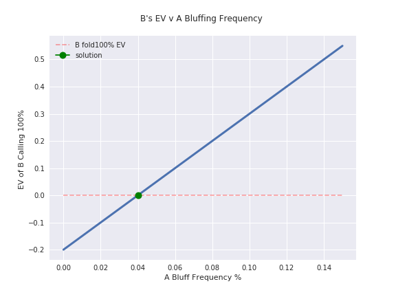

# MATHEMATICS OF POKER PYTHON COMPANION

-----------------

Welcome to my Poker Mathematics in Python Educational Repository!

A collection of Jupyter Notebooks to help you through the materials in The [Mathematics of Poker](https://www.amazon.com/Mathematics-Poker-Bill-Chen/dp/1886070253). 

Here's an example of the kinds of images (and the code) you'll find in this repo:

For each part and chapter, I have a Jupyter Notebook that demonstrates many of the mathematical concepts found in the book. 
I've also added some additional excercises so you can modify the code to answer new questions. This should help you more deeply understand the material. 

This is a work in progress, estimated delivery is end of the summer 2019. 

[Part I: Basics](./chapter_notebooks/part_one/README.md)

[Part II: Exploitive Play](./chapter_notebooks/part_two/README.md)

[Part III: Optimal Play](./chapter_notebooks/part_three/README.md)