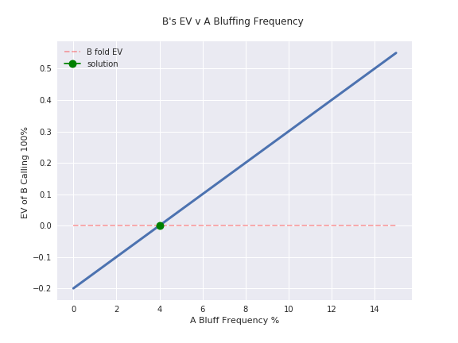

Mathematics of Poker Python Companion
-----------------

A collection of Notebooks, Scripts, Widgets, and Interactive Images to help work through the materials in The [Mathematics of Poker](https://www.amazon.com/Mathematics-Poker-Bill-Chen/dp/1886070253). This repo provides python 3 code to recreate many of the calculations and images in the text. 

For each part and chapter, I have a Jupyter Notebook that demonstrates many of the mathematical concepts found in the book. 
I've also added some additional excercises so you can modify the code to answer new questions. This should help you more deeply understand the material. 

_Here's an example of the kinds of images (and the code) you'll find in this repo:_

------------------

This is a work in progress, estimated delivery is end of the summer 2019. 

[Part I: Basics](./chapter_notebooks/part_one/README.md)

[Part II: Exploitive Play](./chapter_notebooks/part_two/README.md)

[Part III: Optimal Play](./chapter_notebooks/part_three/README.md)